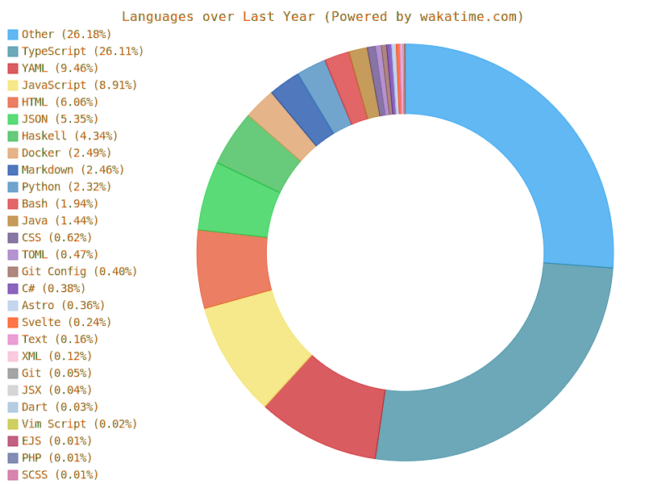

## Welcome to my Github! 👋

Just a student who codes. KU Undergrad

---

<!--START_SECTION:waka-->


**🐱 My GitHub Data** 

> 🏆 293 Contributions in the Year 2022
 > 
> 📦 167.3 kB Used in GitHub's Storage 
 > 
> 💼 Opted to Hire
 > 
> 📜 21 Public Repositories 
 > 
> 🔑 12 Private Repositories  
 > 
**I'm an Early 🐤** 

```text
🌞 Morning    25 commits     ██░░░░░░░░░░░░░░░░░░░░░░░   8.17% 
🌆 Daytime    135 commits    ███████████░░░░░░░░░░░░░░   44.12% 
🌃 Evening    89 commits     ███████░░░░░░░░░░░░░░░░░░   29.08% 
🌙 Night      57 commits     ████░░░░░░░░░░░░░░░░░░░░░   18.63%

```
📅 **I'm Most Productive on Monday** 

```text
Monday       81 commits     ██████░░░░░░░░░░░░░░░░░░░   26.47% 
Tuesday      45 commits     ███░░░░░░░░░░░░░░░░░░░░░░   14.71% 
Wednesday    16 commits     █░░░░░░░░░░░░░░░░░░░░░░░░   5.23% 
Thursday     43 commits     ███░░░░░░░░░░░░░░░░░░░░░░   14.05% 
Friday       49 commits     ████░░░░░░░░░░░░░░░░░░░░░   16.01% 
Saturday     32 commits     ██░░░░░░░░░░░░░░░░░░░░░░░   10.46% 
Sunday       40 commits     ███░░░░░░░░░░░░░░░░░░░░░░   13.07%

```


📊 **This Week I Spent My Time On** 

```text
⌚︎ Time Zone: America/Chicago

💬 Programming Languages: 
TypeScript               11 hrs 47 mins      █████████░░░░░░░░░░░░░░░░   39.32% 
YAML                     6 hrs 9 mins        █████░░░░░░░░░░░░░░░░░░░░   20.52% 
Docker                   2 hrs 20 mins       ██░░░░░░░░░░░░░░░░░░░░░░░   7.8% 
Other                    2 hrs 12 mins       █░░░░░░░░░░░░░░░░░░░░░░░░   7.36% 
JSON                     2 hrs 12 mins       █░░░░░░░░░░░░░░░░░░░░░░░░   7.33%

🔥 Editors: 
VS Code                  28 hrs 51 mins      ████████████████████████░   96.15% 
Browser                  1 hr 6 mins         █░░░░░░░░░░░░░░░░░░░░░░░░   3.67% 
Vim                      3 mins              ░░░░░░░░░░░░░░░░░░░░░░░░░   0.18%

🐱‍💻 Projects: 
ethchain-app             11 hrs 42 mins      █████████░░░░░░░░░░░░░░░░   39.0% 
ChainDashboard           8 hrs 37 mins       ███████░░░░░░░░░░░░░░░░░░   28.77% 
keleti                   5 hrs 48 mins       ████░░░░░░░░░░░░░░░░░░░░░   19.36% 
eth-attack               2 hrs 23 mins       ██░░░░░░░░░░░░░░░░░░░░░░░   7.95% 
.vim_runtime             45 mins             ░░░░░░░░░░░░░░░░░░░░░░░░░   2.53%

```


 Last Updated on 31/10/2022 17:53:48 UTC
<!--END_SECTION:waka-->

---

