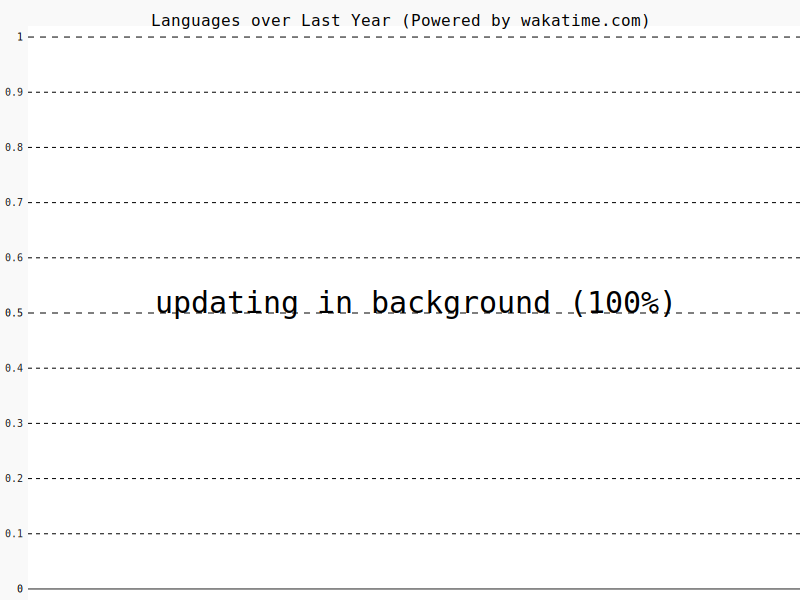
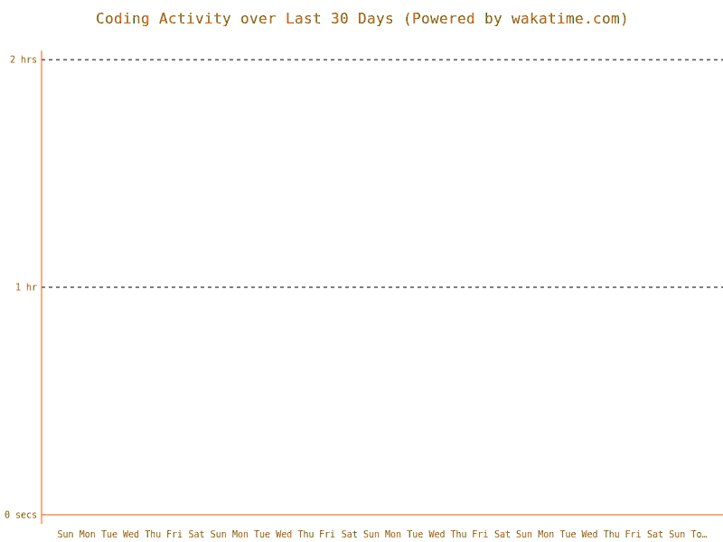

## Welcome to my Github! 👋

[](https://www.linkedin.com/in/mkeleti)   [](https://leetcode.com/mkeleti/)   [](https://mkeleti.com)

Just a student who codes. Member of ACM.

### My Coding Metrics

---

<!--START_SECTION:waka-->


**🐱 My GitHub Data** 

> 🏆 326 Contributions in the Year 2022
 > 
> 📦 167.6 kB Used in GitHub's Storage 
 > 
> 💼 Opted to Hire
 > 
> 📜 21 Public Repositories 
 > 
> 🔑 12 Private Repositories  
 > 
**I'm an Early 🐤** 

```text
🌞 Morning    32 commits     ██░░░░░░░░░░░░░░░░░░░░░░░   9.44% 
🌆 Daytime    160 commits    ███████████░░░░░░░░░░░░░░   47.2% 
🌃 Evening    90 commits     ██████░░░░░░░░░░░░░░░░░░░   26.55% 
🌙 Night      57 commits     ████░░░░░░░░░░░░░░░░░░░░░   16.81%

```
📅 **I'm Most Productive on Monday** 

```text
Monday       106 commits    ███████░░░░░░░░░░░░░░░░░░   31.27% 
Tuesday      45 commits     ███░░░░░░░░░░░░░░░░░░░░░░   13.27% 
Wednesday    20 commits     █░░░░░░░░░░░░░░░░░░░░░░░░   5.9% 
Thursday     44 commits     ███░░░░░░░░░░░░░░░░░░░░░░   12.98% 
Friday       52 commits     ███░░░░░░░░░░░░░░░░░░░░░░   15.34% 
Saturday     32 commits     ██░░░░░░░░░░░░░░░░░░░░░░░   9.44% 
Sunday       40 commits     ███░░░░░░░░░░░░░░░░░░░░░░   11.8%

```


📊 **This Week I Spent My Time On** 

```text
⌚︎ Time Zone: America/Chicago

💬 Programming Languages: 
TypeScript               3 hrs 50 mins       █████░░░░░░░░░░░░░░░░░░░░   20.49% 
Other                    2 hrs 55 mins       ████░░░░░░░░░░░░░░░░░░░░░   15.59% 
JavaScript               2 hrs 39 mins       ███░░░░░░░░░░░░░░░░░░░░░░   14.16% 
Markdown                 2 hrs 38 mins       ███░░░░░░░░░░░░░░░░░░░░░░   14.09% 
Bash                     1 hr 42 mins        ██░░░░░░░░░░░░░░░░░░░░░░░   9.1%

🔥 Editors: 
VS Code                  16 hrs 29 mins      ██████████████████████░░░   87.81% 
Browser                  2 hrs 3 mins        ██░░░░░░░░░░░░░░░░░░░░░░░   10.98% 
Vim                      11 mins             ░░░░░░░░░░░░░░░░░░░░░░░░░   1.03% 
Sublime Text             2 mins              ░░░░░░░░░░░░░░░░░░░░░░░░░   0.18%

🐱‍💻 Projects: 
ChainDashboard           6 hrs 11 mins       ████████░░░░░░░░░░░░░░░░░   32.98% 
ethchain-app             5 hrs 19 mins       ███████░░░░░░░░░░░░░░░░░░   28.3% 
mkeleti.com              2 hrs 27 mins       ███░░░░░░░░░░░░░░░░░░░░░░   13.12% 
ASTHA                    2 hrs 16 mins       ███░░░░░░░░░░░░░░░░░░░░░░   12.13% 
keleti                   1 hr 35 mins        ██░░░░░░░░░░░░░░░░░░░░░░░   8.48%

```


 Last Updated on 04/11/2022 12:53:27 UTC
<!--END_SECTION:waka-->

<p align="center" >


</p>