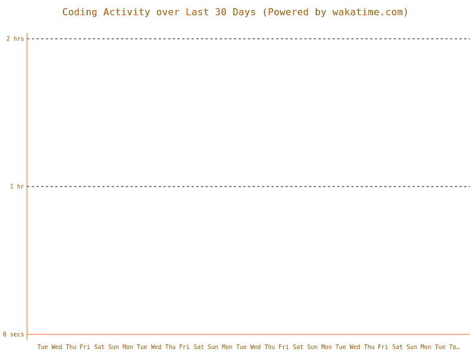

## Welcome to my Github Profile! 👋

[](https://www.linkedin.com/in/mkeleti)   [](https://mkeleti.com)

Just a student who codes. Member of the ACM.

### My Coding Metrics

---

<!--START_SECTION:waka-->
📊 **This Week I Spent My Time On** 

```text
⌚︎ Time Zone: America/Chicago

🔥 Editors: 
VS Code                  2 hrs 56 mins       ███████████████████████░░   94.8% 
Vim                      9 mins              █░░░░░░░░░░░░░░░░░░░░░░░░   5.2%

🐱‍💻 Projects: 
docker-eth-attack        2 hrs 34 mins       ████████████████████░░░░░   83.18% 
mkeleti.github.io        29 mins             ████░░░░░░░░░░░░░░░░░░░░░   16.03% 
keleti                   1 min               ░░░░░░░░░░░░░░░░░░░░░░░░░   0.69% 
aepi-site                0 secs              ░░░░░░░░░░░░░░░░░░░░░░░░░   0.09%

```


 Last Updated on 09/01/2023 12:31:16 UTC
<!--END_SECTION:waka-->

<p align="center" >


</p>